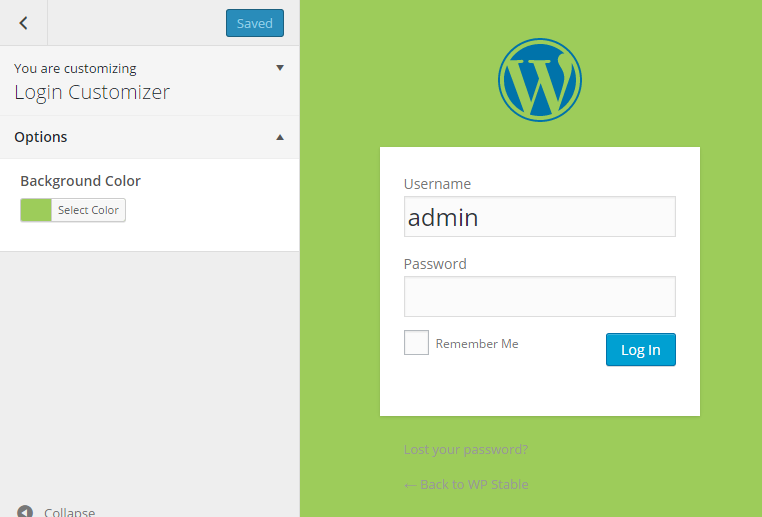

# WordPress Customizer Sandbox

The customizer allows WordPress developers to add options for themes and plugins, but a sandbox is helpful to understand how to.
This sandbox repository is a result, additional source to my session on [WordCamp Cologne MMXV](https://cologne.wordcamp.org/2015/) - slides are here - [bueltge.de/wordpress-customizing](http://bueltge.de/wordpress-customizing/).

Instead of adding options to the `$wp_customize` object directly, developers can just define an array of controls and sections and pass it to the `Customizer_Library` class.

The Customizer Library adds panels, sections, settings and controls to the customizer based on the array that gets passed to it. There is default sanitization for all options. Also it is possible to define custom callbacks. All options are also saved by default as theme_mods. But the customizer is much more and this sandbox show you examples, currently 

 * Customizing of the WordPress Login Page (WP Single Installation, not Multisite ready)
 * Remove, Filter Sections from Default
 * Custom Controls are here: [github.com/bueltge/WordPress-Theme-Customizer-Custom-Controls](https://github.com/bueltge/WordPress-Theme-Customizer-Custom-Controls)
 
 * Also helpful is [this library](https://github.com/WPTRT/code-examples/tree/master/customizer) with much more examples about the defaults, like settings, settings, panels, sanitanization core controls and custom controls from Chip Bennett.
 * [Great overview by Eric Lewis to an awesome API.](https://gist.github.com/ericandrewlewis/2310fd6d7dabf0696965)
 
 * [Extend WP Customize JS Methods](http://wordpress.stackexchange.com/questions/157280/is-it-possible-to-extend-wp-customize-js-methods/208103#208103) 

## Screenshots
Customize the Login Screen  

## Installation
Clone or download the source, activate as plugin and done.

## Other Notes
###Crafted by [Inpsyde](http://inpsyde.com) · Engineering the web since 2006.###
We realize your WordPress project. But yes, we also run that [marketplace for premium WordPress plugins and themes](http://marketpress.com).

### Bugs, technical hints or contribute
Please give me feedback, contribute and file technical bugs on this 
[GitHub Repo](https://github.com/bueltge/customizer-sandbox/issues), use Issues.

### License
Good news, this plugin is free for everyone! Since it's released under the GPL, 
you can use it free of charge on your personal or commercial blog.

### Contact & Feedback
The plugin is designed and developed by me [Frank Bültge](http://bueltge.de), [G+ Page](https://plus.google.com/111291152590065605567/about?rel=author)

Please let me know if you like the plugin or you hate it or whatever ... 
Please fork it, add an issue for ideas and bugs.

### Disclaimer
I'm German and my English might be gruesome here and there. 
So please be patient with me and let me know of typos or grammatical parts. Thanks
